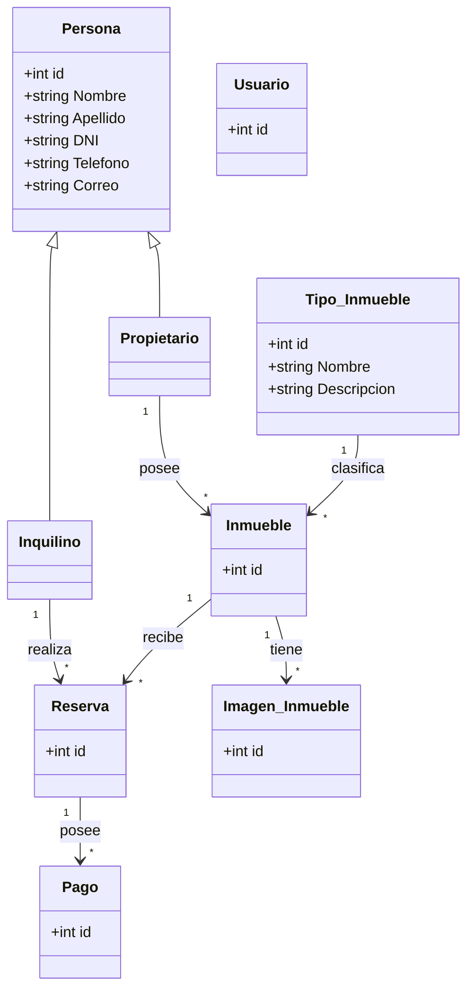

# Sistema Inmobiliario

## 📋 Descripción

Sistema web desarrollado con ASP.NET Core MVC para la gestión de una inmobiliaria.

El proyecto permite administrar diferentes datos relacionados con el funcionamiento de una inmobiliaria, utilizando una arquitectura MVC y una base de datos MySQL.

Actualmente el sistema trabaja con:

- Propietarios
- Inquilinos
- Inmuebles
- Tipos de Inmueble
- Reservas

Para acceder a los datos se implementó el patrón Repositorio, separando la lógica de acceso a la base de datos del resto de la aplicación.

---

## 👥 Integrantes del Grupo

* **Matias Martinez** - *matias.e.martinez1993@gmail.com* - (https://github.com/MatiasMartinez-22) - Discord: `matiasaitam2224188`
* **Alberto Daroni** - *albertodaroni@gmail.com* - (https://github.com/AlbertDaroni) - Discord: `white_shadow71717`
* **Jonatan Aguero** - *david.joni2401@gmail.com* - (https://github.com/davidjoni2401-sudo) - Discord: `jonatan`

---

## 📐 Modelado del Sistema

El sistema está organizado utilizando el patrón MVC (Modelo - Vista - Controlador).

### Modelos

Los modelos representan las principales entidades utilizadas por el sistema:

- Persona
- Propietario
- Inquilino
- Inmueble
- Imagen_Inmueble
- Tipo_Inmueble
- Reserva
- Pago
- Usuario

`Propietario` e `Inquilino` heredan los datos generales definidos en la clase `Persona`.

### Diagrama simplificado



> El diagrama muestra de manera simplificada las principales entidades y relaciones del sistema.

---

## 🗄️ Base de Datos

El proyecto utiliza **MySQL** como sistema gestor de base de datos.

La aplicación realiza el acceso a los datos mediante repositorios y utiliza **MySqlConnector** para establecer la conexión con MySQL.

El repositorio contiene el archivo:

`DataBase/bd.sql`

Este archivo contiene las instrucciones necesarias para crear e inicializar la base de datos utilizada por el sistema.

### Configuración de la base de datos

1. Iniciar MySQL desde XAMPP o desde el servidor MySQL utilizado.
2. Abrir un gestor de base de datos.
3. Abrir el archivo `DataBase/bd.sql`.
4. Ejecutar completamente el script.
5. Verificar que la base de datos y sus tablas hayan sido creadas correctamente.
6. Configurar la cadena de conexión correspondiente en `appsettings.json`.
7. Ejecutar el proyecto.

---

## 🗂️ Patrón Repositorio

Para organizar el acceso a los datos se utiliza el patrón Repositorio.

Se definieron interfaces para indicar las operaciones disponibles y clases encargadas de realizar las consultas sobre MySQL.

Entre los repositorios utilizados se encuentran:

- Repositorio de Propietarios
- Repositorio de Inquilinos
- Repositorio de Inmuebles
- Repositorio de Imágenes de Inmuebles
- Repositorio de Tipos de Inmueble
- Repositorio de Reservas

Esto permite separar las consultas SQL de los controladores y mantener una mejor organización del proyecto.

---

## 🔄 Inyección de Dependencias

Los repositorios utilizados por los controladores se registran mediante el sistema de inyección de dependencias de ASP.NET Core.

De esta forma, los controladores trabajan con las interfaces de los repositorios en lugar de crear directamente las clases encargadas del acceso a MySQL.

---

## ⚙️ Ejecución del Proyecto

### 1. Clonar el repositorio

```bash
git clone https://github.com/AlbertDaroni/Ejercicio-1.git
```

### 2. Ingresar al proyecto

```bash
cd Ejercicio-1
```

### 3. Preparar la base de datos

Ejecutar el archivo:

```text
DataBase/bd.sql
```

### 4. Configurar la conexión

Configurar la cadena de conexión a MySQL dentro de:

```text
appsettings.json
```

Los datos de usuario, contraseña, servidor y base de datos deben coincidir con la configuración local de MySQL.

### 5. Restaurar dependencias

```bash
dotnet restore
```

### 6. Compilar el proyecto

```bash
dotnet build
```

### 7. Ejecutar

```bash
dotnet run
```

Una vez iniciado, ingresar desde el navegador a la dirección indicada por ASP.NET Core en la terminal.

---

## ✅ Funcionalidades Implementadas

### 👤 Propietarios

Permite realizar operaciones de administración sobre los propietarios:

- Alta.
- Listado.
- Consulta de detalles.
- Modificación.
- Baja o eliminación.

### 👥 Inquilinos

Permite realizar operaciones de administración sobre los inquilinos:

- Alta.
- Listado.
- Consulta de detalles.
- Modificación.
- Baja o eliminación.

### 🏠 Inmuebles

Se incorporó la administración de inmuebles dentro del sistema.

Entre las operaciones disponibles se encuentran:

- Alta de inmuebles.
- Listado de inmuebles.
- Consulta de detalles.
- Modificación.
- Eliminación.
- Asociación con los datos correspondientes del sistema.

### 🏷️ Tipos de Inmueble

Permite administrar los diferentes tipos utilizados para clasificar los inmuebles.

Por ejemplo:

- Casa.
- Departamento.
- Local.
- Terreno.

Las operaciones implementadas incluyen:

- Alta.
- Listado.
- Consulta de detalles.
- Modificación.
- Eliminación.

### 📅 Reservas

Se incorporó la gestión de reservas de los inmuebles.

Las reservas permiten relacionar la información correspondiente al inmueble y al inquilino involucrado en la operación.

Se implementaron las operaciones necesarias para administrar las reservas dentro del sistema.

### 🖼️ Imágenes de Inmuebles

El proyecto incluye el modelo y repositorio correspondiente para trabajar con imágenes asociadas a los inmuebles.

---

## 🏗️ Estructura General del Proyecto

```text
Ejercicio-1/
│
├── Controllers/
│   ├── Home_Controller.cs
│   ├── Propietario_Controller.cs
│   ├── Inquilino_Controller.cs
│   ├── Inmueble_Controller.cs
│   ├── Tipo_Inmueble_Controller.cs
│   └── Reserva_Controller.cs
│
├── Models/
│   ├── Persona.cs
│   ├── Propietario.cs
│   ├── Inquilino.cs
│   ├── Inmueble.cs
│   ├── Imagen_Inmueble.cs
│   ├── Tipo_Inmueble.cs
│   ├── Reserva.cs
│   ├── Pago.cs
│   └── Usuario.cs
│
├── Repositorios/
│   ├── Interfaces
│   ├── Repositorios MySQL
│   └── RepositorioBase.cs
│
├── Views/
│   ├── Propietario_/
│   ├── Inquilino_/
│   ├── Inmueble_/
│   ├── Tipo_Inmueble_/
│   ├── Reserva_/
│   └── Shared/
│
├── DataBase/
│   └── bd.sql
│
├── wwwroot/
├── Program.cs
├── appsettings.json
└── README.md
```

---

## 🛠️ Tecnologías Utilizadas

- ASP.NET Core MVC
- C#
- Razor / CSHTML
- HTML
- CSS
- Bootstrap
- MySQL
- MySqlConnector
- XAMPP
- Git
- GitHub

---

## 📌 Estado del Proyecto

El proyecto se encuentra actualmente en desarrollo como parte del trabajo práctico de la materia.

En esta etapa se amplió el sistema inicial de gestión de propietarios e inquilinos, incorporando la gestión de inmuebles, tipos de inmueble y reservas, junto con sus correspondientes controladores, vistas y repositorios.

El proyecto continuará evolucionando en las siguientes etapas de acuerdo con los requerimientos establecidos para el sistema inmobiliario.