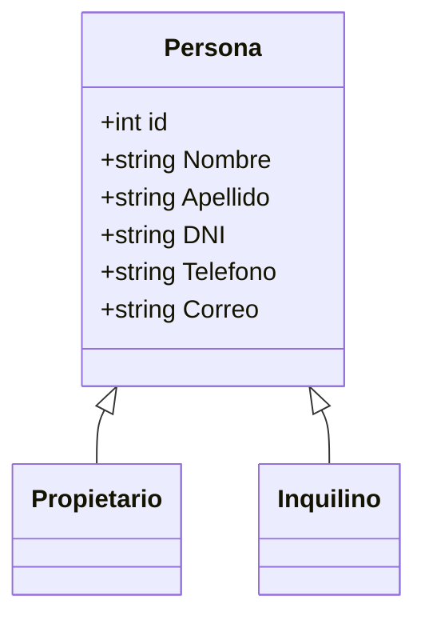

# Sistema Inmobiliario

## Descripción

Sistema web desarrollado con ASP.NET MVC para la gestión
de una inmobiliaria.

Para la primera entrega se implementa el ABM de:

- Propietarios
- Inquilinos
---

## 👥 Integrantes del Grupo

* **Matias Martinez** - *matias.e.martinez1993@gmail.com* - (https://github.com/MatiasMartinez-22) - Discord: `matiasaitam2224188`
* **Alberto Daroni** - *albertodaroni@gmail.com* - (https://github.com/AlbertDaroni) - Discord: `white_shadow71717`
* **Jonatan Aguero** - *david.joni2401@gmail.com* - (https://github.com/davidjoni2401-sudo) - Discord: `jonatan`

---

## 📐 Modelado de Datos

A continuación se presenta el esquema del modelo de datos correspondiente a la primera entrega del Sistema Inmobiliario.

### Diagrama de Clases basado en la primera entrega



> El diagrama representa la relación entre Persona, Propietario e Inquilino.

> Propietario e Inquilino heredan los datos generales definidos en Persona.

## 🗄️ Base de Datos

El proyecto utiliza una base de datos para almacenar la información de propietarios e inquilinos.

El repositorio contiene el archivo:

`bd.sql`

Este archivo posee las instrucciones necesarias para crear e inicializar la base de datos del sistema.

### Pasos para crear la base de datos

1. Abrir el gestor de base de datos utilizado para el proyecto.
2. Crear una nueva conexión con el servidor de base de datos.
3. Abrir el archivo `bd.sql`.
4. Ejecutar completamente el script.
5. Verificar que se haya creado correctamente la base de datos.
6. Verificar que existan las tablas correspondientes a Propietarios e Inquilinos.
7. Configurar la cadena de conexión del proyecto en `appsettings.json`.
8. Ejecutar el proyecto ASP.NET MVC.

---

## ⚙️ Ejecución del Proyecto

1. Clonar el repositorio.

```http://localhost:5090```

2. Abrir el proyecto en Visual Studio.

3. Configurar la conexión con la base de datos.

4. Ejecutar el archivo `bd.sql` para crear la base de datos.

5. Ejecutar el proyecto ASP.NET MVC.

---

## ✅ Funcionalidades de la Primera Entrega

### Propietarios

- Alta de propietarios.
- Listado de propietarios.
- Modificación de propietarios.
- Baja de propietarios.
- Eliminacion de propietarios.

### Inquilinos

- Alta de inquilinos.
- Listado de inquilinos.
- Modificación de inquilinos.
- Baja de inquilinos.
- Eliminacion de inquilinos.

---

## 🛠️ Tecnologías utilizadas

- ASP.NET MVC
- C#
- HTML
- CSS
- Base de datos:  Xampp,  MySQL/MySqlConnector
- Git
- GitHub
