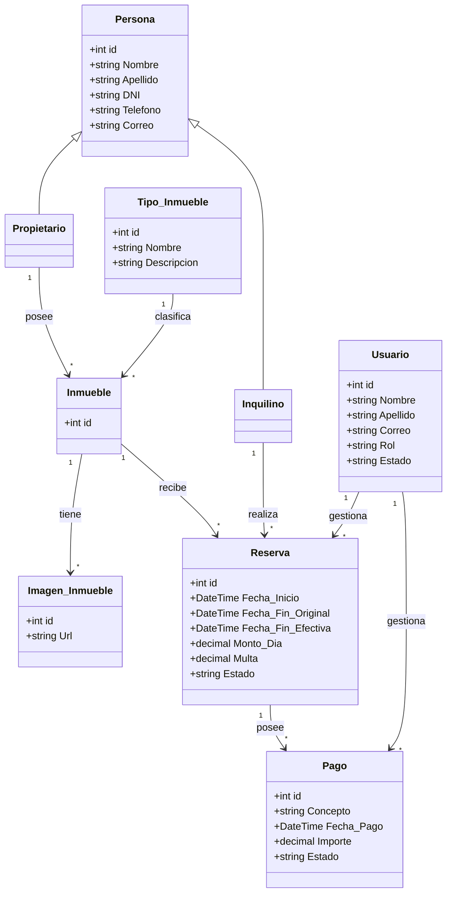

# Sistema Inmobiliario

## 📋 Descripción

Sistema web desarrollado con **ASP.NET Core MVC** para la gestión de una inmobiliaria.

El proyecto permite administrar diferentes datos relacionados con el funcionamiento de una inmobiliaria, utilizando una arquitectura **MVC**, una base de datos **MySQL** y el patrón **Repositorio** para separar el acceso a los datos de la lógica de la aplicación.

Actualmente el sistema trabaja con:

- Propietarios
- Inquilinos
- Inmuebles
- Tipos de Inmueble
- Reservas
- Pagos
- Usuarios
- Autenticación y autorización por roles

---

## 👥 Integrantes del Grupo

* **Matias Martinez** - *matias.e.martinez1993@gmail.com* - (https://github.com/MatiasMartinez-22) - Discord: `matiasaitam2224188`
* **Alberto Daroni** - *albertodaroni@gmail.com* - (https://github.com/AlbertDaroni) - Discord: `white_shadow71717`
* **Jonatan Aguero** - *david.joni2401@gmail.com* - (https://github.com/davidjoni2401-sudo) - Discord: `jonatan`

---

## 📐 Modelado del Sistema

El sistema está organizado utilizando el patrón **MVC (Modelo - Vista - Controlador)**.

### Modelos

Los modelos representan las principales entidades utilizadas por el sistema:

- Persona
- Propietario
- Inquilino
- Inmueble
- Imagen_Inmueble
- Tipo_Inmueble
- Reserva
- Pago
- Usuario

`Propietario` e `Inquilino` heredan los datos generales definidos en la clase `Persona`.

### Diagrama simplificado



> El diagrama muestra de manera simplificada las principales entidades y relaciones del sistema.

---

## 🗄️ Base de Datos

El proyecto utiliza **MySQL** como sistema gestor de base de datos.

La aplicación realiza el acceso a los datos mediante repositorios y utiliza **MySqlConnector** para establecer la conexión con MySQL.

El repositorio contiene el archivo:

```text
DataBase/bd.sql
```

Este archivo contiene las instrucciones necesarias para crear e inicializar la base de datos utilizada por el sistema.

El script crea las tablas correspondientes e incorpora datos iniciales para facilitar las pruebas del sistema.

### Configuración de la base de datos

1. Iniciar MySQL desde XAMPP o desde el servidor MySQL utilizado.
2. Abrir un gestor de base de datos.
3. Abrir el archivo `DataBase/bd.sql`.
4. Ejecutar completamente el script.
5. Verificar que la base de datos `Inmobiliaria` y sus tablas hayan sido creadas correctamente.
6. Configurar la cadena de conexión correspondiente en `appsettings.json`.
7. Ejecutar el proyecto.

---

## 🔐 Autenticación y Roles

El sistema cuenta con autenticación mediante **correo electrónico y contraseña**.

Cuando un usuario inicia sesión correctamente, la aplicación utiliza autenticación para mantener la sesión e identificar al usuario que está utilizando el sistema.

También se implementó autorización mediante **roles**, permitiendo restringir determinadas operaciones.

Entre los roles utilizados para las pruebas se encuentran:

- Administrador
- Empleado

Algunas operaciones sensibles, como determinadas bajas o finalizaciones, se encuentran restringidas al rol **Administrador**.

---

## 👤 Usuarios de Prueba

Al ejecutar el archivo `DataBase/bd.sql` se crean usuarios que permiten probar la autenticación y los diferentes permisos del sistema.

### Administrador

- **Correo:** `admin@inmobiliaria.com`
- **Contraseña:** `1234`
- **Rol:** Administrador

El usuario administrador puede acceder a las funcionalidades que requieren permisos administrativos.

### Empleado

- **Correo:** `empleado@inmobiliaria.com`
- **Contraseña:** `1234`
- **Rol:** Empleado

El usuario empleado puede iniciar sesión y utilizar las funcionalidades habilitadas para su rol.

> Estas credenciales se incluyen únicamente con fines académicos y de prueba.

---

## 🗂️ Patrón Repositorio

Para organizar el acceso a los datos se utiliza el patrón **Repositorio**.

Se definieron interfaces que establecen las operaciones disponibles y clases encargadas de realizar las consultas sobre MySQL.

Entre los repositorios utilizados se encuentran:

- Repositorio de Propietarios
- Repositorio de Inquilinos
- Repositorio de Inmuebles
- Repositorio de Imágenes de Inmuebles
- Repositorio de Tipos de Inmueble
- Repositorio de Reservas
- Repositorio de Pagos
- Repositorio de Usuarios

Esto permite separar las consultas SQL de los controladores y mantener una mejor organización del proyecto.

---

## 🔄 Inyección de Dependencias

Los repositorios utilizados por los controladores se registran mediante el sistema de **inyección de dependencias de ASP.NET Core**.

De esta forma, los controladores trabajan con las interfaces de los repositorios en lugar de crear directamente las clases encargadas del acceso a MySQL.

Esto facilita la organización, mantenimiento y reutilización del código.

---

## ⚙️ Ejecución del Proyecto

### 1. Clonar el repositorio

```bash
git clone https://github.com/AlbertDaroni/Ejercicio-1.git
```

### 2. Ingresar al proyecto

```bash
cd Ejercicio-1
```

### 3. Preparar la base de datos

Ejecutar el archivo:

```text
DataBase/bd.sql
```

Esto creará la base de datos `Inmobiliaria`, sus tablas y los datos necesarios para realizar pruebas.

### 4. Configurar la conexión

Configurar la cadena de conexión a MySQL dentro de:

```text
appsettings.json
```

Los datos de usuario, contraseña, servidor y base de datos deben coincidir con la configuración local de MySQL.

### 5. Restaurar dependencias

```bash
dotnet restore
```

### 6. Compilar el proyecto

```bash
dotnet build
```

### 7. Ejecutar

```bash
dotnet run
```

Una vez iniciado el proyecto, ingresar desde el navegador a la dirección indicada por ASP.NET Core en la terminal.

Luego se puede iniciar sesión utilizando alguno de los usuarios de prueba indicados anteriormente.

---

## ✅ Funcionalidades Implementadas

### 🔐 Inicio de Sesión

El sistema permite:

- Iniciar sesión mediante correo electrónico y contraseña.
- Identificar al usuario autenticado.
- Cerrar sesión.
- Trabajar con roles.
- Restringir determinadas operaciones según el rol del usuario.
- Registrar qué usuario realiza determinadas operaciones del sistema.

---

### 👤 Propietarios

Permite realizar operaciones de administración sobre los propietarios:

- Alta.
- Listado.
- Consulta de detalles.
- Modificación.
- Baja o eliminación.

Los propietarios pueden ser asociados a los inmuebles registrados en el sistema.

---

### 👥 Inquilinos

Permite realizar operaciones de administración sobre los inquilinos:

- Alta.
- Listado.
- Consulta de detalles.
- Modificación.
- Baja o eliminación.

Los inquilinos pueden ser asociados posteriormente a las reservas.

---

### 🏠 Inmuebles

Se incorporó la administración de inmuebles dentro del sistema.

Entre las operaciones disponibles se encuentran:

- Alta de inmuebles.
- Listado de inmuebles.
- Consulta de detalles.
- Modificación.
- Eliminación.
- Asociación con un propietario.
- Asociación con un tipo de inmueble.
- Manejo del estado del inmueble.
- Precio por día.
- Porcentaje de seña.
- Cupo del inmueble.

---

### 🏷️ Tipos de Inmueble

Permite administrar los diferentes tipos utilizados para clasificar los inmuebles.

Por ejemplo:

- Casa.
- Departamento.
- Local.
- Terreno.
- Oficina.
- Cochera.
- Duplex.

Las operaciones implementadas incluyen:

- Alta.
- Listado.
- Consulta de detalles.
- Modificación.
- Eliminación.

---

### 📅 Reservas

El sistema permite gestionar reservas asociando un **inquilino** con un **inmueble**.

Las reservas almacenan información como:

- Fecha de creación.
- Fecha de inicio.
- Fecha de finalización original.
- Fecha de finalización efectiva.
- Monto por día.
- Multa.
- Estado.
- Inquilino.
- Inmueble.
- Usuario creador.
- Usuario finalizador.

Entre las operaciones disponibles se encuentran:

- Creación de reservas.
- Listado.
- Consulta de detalles.
- Modificación.
- Finalización de reservas.

La finalización se realiza mediante una **baja lógica**, por lo que la reserva no se elimina físicamente de la base de datos.

Al finalizar una reserva:

- Se modifica su estado.
- Se conserva el registro en la base de datos.
- Se registra el usuario que realizó la finalización.

Esto permite mantener un historial de las operaciones realizadas.

---

### 💵 Pagos

El sistema incluye la gestión de pagos asociados a las reservas.

Cada pago puede almacenar:

- Concepto.
- Fecha de pago.
- Importe.
- Estado.
- Reserva asociada.
- Usuario creador.
- Usuario finalizador.
- Fecha de anulación.

Entre las operaciones disponibles se encuentran:

- Registro de pagos.
- Listado.
- Consulta de detalles.
- Modificación.
- Anulación de pagos.

Los pagos utilizan una **baja lógica**, evitando eliminar físicamente los registros de la base de datos.

Cuando un pago es anulado:

- Se modifica su estado.
- Se registra la fecha de anulación.
- Se registra el usuario que realizó la operación.
- El registro permanece almacenado en la base de datos.

---

### 🖼️ Imágenes de Inmuebles

El proyecto incluye el modelo y repositorio correspondiente para trabajar con imágenes asociadas a los inmuebles.

Esto permite relacionar uno o varios registros de imágenes con un inmueble.

---

## 🏗️ Estructura General del Proyecto

```text
Ejercicio-1/
│
├── Controllers/
│   ├── Cuenta_Controller.cs
│   ├── Home_Controller.cs
│   ├── Propietario_Controller.cs
│   ├── Inquilino_Controller.cs
│   ├── Inmueble_Controller.cs
│   ├── Tipo_Inmueble_Controller.cs
│   ├── Reserva_Controller.cs
│   └── Pago_Controller.cs
│
├── Models/
│   ├── Persona.cs
│   ├── Propietario.cs
│   ├── Inquilino.cs
│   ├── Inmueble.cs
│   ├── Imagen_Inmueble.cs
│   ├── Tipo_Inmueble.cs
│   ├── Reserva.cs
│   ├── Pago.cs
│   ├── Usuario.cs
│   └── LoginViewModel.cs
│
├── Repositorios/
│   ├── IRepositorio_Propietario.cs
│   ├── IRepositorio_Inquilino.cs
│   ├── IRepositorio_Inmueble.cs
│   ├── IRepositorio_Imagen_Inmueble.cs
│   ├── IRepositorio_Tipo_Inmueble.cs
│   ├── IRepositorio_Reserva.cs
│   ├── IRepositorio_Pago.cs
│   ├── IRepositorio_Usuario.cs
│   ├── Repositorios MySQL
│   └── RepositorioBase.cs
│
├── Views/
│   ├── Cuenta_/
│   ├── Home_/
│   ├── Propietario_/
│   ├── Inquilino_/
│   ├── Inmueble_/
│   ├── Tipo_Inmueble_/
│   ├── Reserva_/
│   ├── Pago_/
│   └── Shared/
│
├── DataBase/
│   └── bd.sql
│
├── wwwroot/
├── Program.cs
├── appsettings.json
└── README.md
```

---

## 🛠️ Tecnologías Utilizadas

- ASP.NET Core MVC
- C#
- .NET
- Razor / CSHTML
- HTML
- CSS
- Bootstrap
- MySQL
- MySqlConnector
- XAMPP
- Git
- GitHub

---

## 🔒 Control de Acceso

El sistema utiliza autenticación y autorización para controlar el acceso a determinadas operaciones.

Cada usuario posee un rol que permite determinar las acciones que puede realizar.

Además, en operaciones como reservas y pagos se registra el usuario responsable de determinadas acciones, permitiendo mantener información sobre quién creó o finalizó un registro.

---

## 📌 Estado del Proyecto

El proyecto se encuentra actualmente en desarrollo como parte del trabajo práctico de la materia.

En esta etapa se implementaron y ampliaron las funcionalidades relacionadas con:

- Propietarios.
- Inquilinos.
- Inmuebles.
- Tipos de inmueble.
- Reservas.
- Pagos.
- Usuarios.
- Inicio y cierre de sesión.
- Autorización mediante roles.
- Registro de usuarios responsables de operaciones.
- Baja lógica en reservas y pagos.

El proyecto continuará evolucionando de acuerdo con los requerimientos establecidos para el sistema inmobiliario.